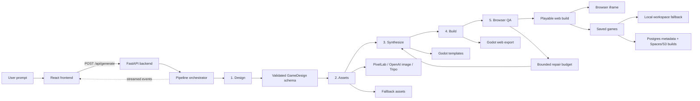

# Architecture

This is the compact diagram to use when explaining how Godot Agent turns one prompt into a playable game.

## Files To Show In The Demo

Open these tabs before recording so you can jump through them quickly.

| File | What to say |
|---|---|
| [`README.md`](../README.md) | "This is the five-stage architecture: Design, Assets, Synthesize, Build, QA." |
| [`backend/agent/pipeline.py`](../backend/agent/pipeline.py) | "This orchestrates the five phases and manages repair flow." |
| [`backend/agent/schema.py`](../backend/agent/schema.py) | "The LLM produces a validated GameDesign, so generation is structured." |
| [`backend/agent/build.py`](../backend/agent/build.py) | "Godot exports the generated project as a browser-playable web build." |
| [`frontend/src/useGenerate.ts`](../frontend/src/useGenerate.ts) | "The frontend streams progress and updates the phase cards, saved games, and iframe." |

## Short Video Script

1. Show the prompt being submitted in the app.
2. Show the phase cards progressing.
3. Cut to this diagram for 15-20 seconds.
4. Jump through the files above for another 15-20 seconds.
5. Return to the app and show the playable result.
